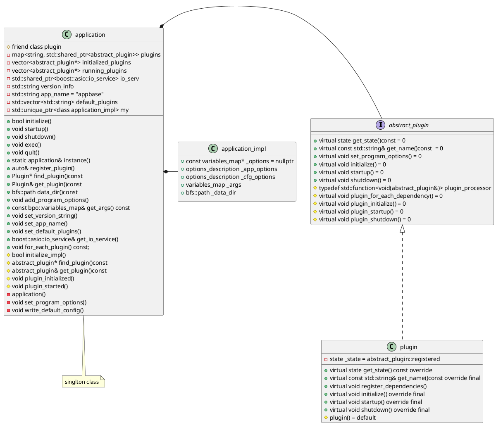
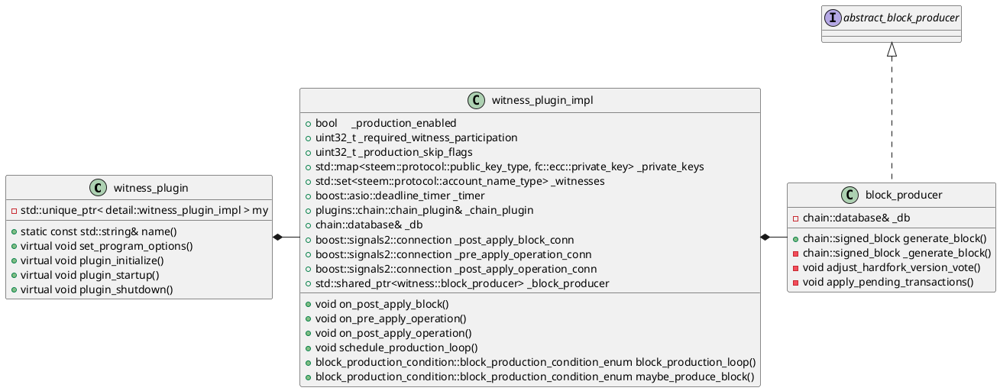
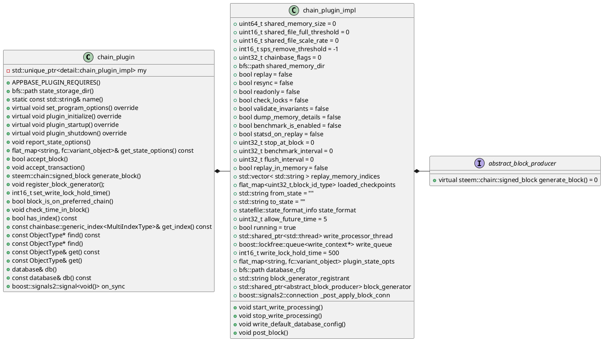

# STEEM

## 背景

Steem是一个区块链数据库，通过加密货币奖励支持社区建设和社交互动。Steem将来自社交媒体的概念与构建加密货币及其社区的经验教训相结合。激励参与任何社区、货币或自由市场经济的一个重要关键是公平的会计制度，该制度始终如一地反映每个人的贡献。Steem是第一个试图准确透明地奖励对其社区做出主观贡献的无限数量的个人的加密货币。

## 架构

### 源码结构

- ciscripts: CI相关脚本
- contrib: 发版工具
- doc: 文档
- example_plugins: 插件示例
- external_plugins: 
- libraries: 
  - app-base: steemd的服务接口，用于构建应用程序，管理插件生命周期
  - chain: steem链核心组件
  - chainbase:
  - fc: 部分外部库
  - jsonball:
  - legacy_plugins:
  - manifest:
  - mira:
  - net: 网络接口
  - plugins: 插件实例
  - protocol:
  - schema:
  - utilities: 部分工具接口
  - vendor: rockdb源码
  - wallet: 钱包
- programs: STEEM相关服务进程
- python_scripts: 部分debug和测试工具
- tests: 单测

### 核心类
- application



- witness plugin

- chain plugin


- wallet

```plantuml
@startuml
class wallet_api {
  + bool copy_wallet_file()
  + string help()const
  + variant info()
  + variant_object about() const
  + optional< condenser_api::legacy_signed_block > get_block()
  + vector< condenser_api::api_operation_object > get_ops_in_block()
  + condenser_api::api_feed_history_object get_feed_history()const
  + vector< account_name_type > get_active_witnesses()const
  + condenser_api::state get_state()
  + vector< database_api::api_withdraw_vesting_route_object > get_withdraw_routes()const
  + vector< condenser_api::api_account_object > list_my_accounts()
  + vector< account_name_type > list_accounts()
  + condenser_api::extended_dynamic_global_properties get_dynamic_global_properties() const
  + condenser_api::api_account_object get_account() const
  + database_api::api_smt_account_balance_object get_smt_balance() const
  + string get_wallet_filename() const;
  + string get_private_key()const
  + pair<public_key_type,string>  get_private_key_from_password()const
  + condenser_api::legacy_signed_transaction get_transaction()const
  + bool is_new()const
  + bool is_locked()const
  + void lock()
  + void unlock()
  + void set_password()
  + void exit()
  + map<public_key_type, string> list_keys()
  + string  gethelp(const string& method)const
  + bool load_wallet_file()
  + void save_wallet_file()
  + void set_wallet_filename()
  + brain_key_info suggest_brain_key()const
  + string serialize_transaction() const
  + bool import_key()
  + string normalize_brain_key() const
  + condenser_api::legacy_signed_transaction create_account()
  + condenser_api::legacy_signed_transaction create_account_with_keys()const
  + condenser_api::legacy_signed_transaction create_account_delegated()
  + condenser_api::legacy_signed_transaction create_account_with_keys_delegated()const
  + condenser_api::legacy_signed_transaction update_account()const
  + condenser_api::legacy_signed_transaction update_account_auth_key()
  + condenser_api::legacy_signed_transaction update_account_auth_account()
  + condenser_api::legacy_signed_transaction update_account_auth_threshold()
  + condenser_api::legacy_signed_transaction update_account_meta()
  + condenser_api::legacy_signed_transaction update_account_memo_key()
  + condenser_api::legacy_signed_transaction delegate_vesting_shares()
  + transaction_id_type get_transaction_id( const signed_transaction& trx )const
  + vector< account_name_type > list_witnesses()
  + optional< condenser_api::api_witness_object > get_witness()
  + vector< condenser_api::api_convert_request_object > get_conversion_requests()
  + condenser_api::legacy_signed_transaction update_witness()
  + condenser_api::legacy_signed_transaction set_voting_proxy()
  + condenser_api::legacy_signed_transaction vote_for_witness()
  + condenser_api::legacy_signed_transaction transfer()
  + condenser_api::legacy_signed_transaction escrow_transfer()
  + condenser_api::legacy_signed_transaction escrow_approve()
  + condenser_api::legacy_signed_transaction escrow_dispute()
  + condenser_api::legacy_signed_transaction escrow_release()
  + condenser_api::legacy_signed_transaction transfer_to_vesting()
  + condenser_api::legacy_signed_transaction transfer_to_savings()
  + condenser_api::legacy_signed_transaction transfer_from_savings()
  + condenser_api::legacy_signed_transaction cancel_transfer_from_savings()
  + condenser_api::legacy_signed_transaction withdraw_vesting()
  + condenser_api::legacy_signed_transaction set_withdraw_vesting_route()
  + condenser_api::legacy_signed_transaction convert_sbd()
  + condenser_api::legacy_signed_transaction publish_feed()
  + condenser_api::legacy_signed_transaction sign_transaction()
  + condenser_api::legacy_signed_transaction sign_transaction_with_key()
  + annotated_signed_transaction broadcast_transaction()
  + operation get_prototype_operation()
  + condenser_api::get_order_book_return get_order_book()
  + vector< condenser_api::api_limit_order_object > get_open_orders()
  + condenser_api::legacy_signed_transaction create_order()
  + condenser_api::legacy_signed_transaction cancel_order()
  + condenser_api::legacy_signed_transaction post_comment()
  + condenser_api::legacy_signed_transaction vote()
  + void set_transaction_expiration()
  + condenser_api::legacy_signed_transaction request_account_recovery()
  + condenser_api::legacy_signed_transaction recover_account()
  + condenser_api::legacy_signed_transaction change_recovery_account()
  + vector< database_api::api_owner_authority_history_object > get_owner_history()const
  + map< uint32_t, condenser_api::api_operation_object > get_account_history()
  + condenser_api::legacy_signed_transaction follow()
  + void check_memo()const
  + string get_encrypted_memo()
  + string decrypt_memo()
  + condenser_api::legacy_signed_transaction decline_voting_rights()
  + condenser_api::legacy_signed_transaction claim_reward_balance()
  + condenser_api::legacy_signed_transaction create_proposal()
  + condenser_api::legacy_signed_transaction update_proposal_votes()
  + condenser_api::list_proposals_return list_proposals()
  + condenser_api::find_proposals_return find_proposals()
  + condenser_api::list_proposal_votes_return list_proposal_votes()
  + condenser_api::legacy_signed_transaction remove_proposal()
  + condenser_api::legacy_signed_transaction create_smt()
  + condenser_api::legacy_signed_transaction smt_set_setup_parameters()
  + condenser_api::legacy_signed_transaction smt_set_runtime_parameters()
  + condenser_api::legacy_signed_transaction smt_setup_emissions()
  + condenser_api::legacy_signed_transaction smt_setup()
  + condenser_api::legacy_signed_transaction smt_setup_ico_tier()
  + condenser_api::legacy_signed_transaction smt_contribute()
  + vector< asset_symbol_type > get_nai_pool()
  + std::map<string,std::function<string(fc::variant,const fc::variants&)>> get_result_formatters() const
  + fc::signal<void(bool)> lock_changed
  - std::shared_ptr<detail::wallet_api_impl> my
  - std::shared_ptr<fc::rpc::cli> cli
  - void encrypt_keys()
}

class wallet_api_impl {
  + api_documentation method_documentation;
  - void enable_umask_protection()
  - void disable_umask_protection()
  - void init_prototype_ops()
  + wallet_api& self;
  + void encrypt_keys()
  + bool copy_wallet_file()
  + bool is_locked()const
  + variant info() const
  + variant_object about() const
  + condenser_api::api_account_object get_account() const
  + database_api::api_smt_account_balance_object get_smt_balance() const
  + string get_wallet_filename() const
  + optional<fc::ecc::private_key> try_get_private_key()const
  + fc::ecc::private_key get_private_key()const
  + fc::ecc::private_key get_private_key_for_account()const
  + bool import_key()
  + bool load_wallet_file()
  + void save_wallet_file()
  + signed_transaction create_account_with_private_key()
  + signed_transaction set_voting_proxy()
  + optional<condenser_api::api_witness_object> get_witness()
  + void set_transaction_expiration()
  + annotated_signed_transaction broadcast_transaction()
  + annotated_signed_transaction sign_transaction()
  + annotated_signed_transaction sign_transaction_with_key()
  + std::map<string,std::function<string(fc::variant,const fc::variants&)>> get_result_formatters() const
  + operation get_prototype_operation()
  + string _wallet_filename
  + wallet_data _wallet
  + steem::protocol::chain_id_type steem_chain_id
  + map<public_key_type,string> _keys
  + fc::sha512 _checksum
  + fc::api<remote_node_api> _remote_api
  + uint32_t _tx_expiration_seconds = 30
  + flat_map<string, operation> _prototype_ops
  + static_variant_map _operation_which_map = create_static_variant_map< operation >()
  + mode_t _old_umask
  + const string _wallet_filename_extension = ".wallet"
}

wallet_api *- wallet_api_impl
@enduml
```

### STEEM架构

## 关键组件

### 区块链

#### 目击者机制
- Witness
  - Steem通过witness操作服务器生成区块，并存储完整的区块链数据。这些区块数据包含有关帖子、评论、投票和货币转账的信息。
  - Steem区块链需要一组witness来创建区块，并使用称为委托权益证明（DPOS）的共识机制。社区通过投票选举一组witness作为网络中的区块生产者和治理机构。
  - Steem网络中也存在着非witness的普通用户，是Steem区块链网络的普通参与者，可以从其他节点接受数据、传播数据。普通用户参与投票选举见证人，发起交易，参与社区活动等，但它们不具有直接的区块生产权限。
  - Steem网络循环调度witness，网络中一共21个witness（20个全职位，剩下的预备witness共享一个witness位），所有的witness调度一轮需要63秒（每个witness每63秒被调用一次）。
  - witness在产块后会获得相应的SP奖励。
  - witness产块失败不影响后续witness产块，但可能被投票失去witness地位。

- Witness选举
  - 每个投票者拥有30张选票
  - 投票方式：
    1. 通过steemd投票
    2. 在steem网站投票
    3. 通过代理人投票
  - 选举过程
    1. 用户生成投票对象
    2. 将投票对象进行广播
    3. 链上节点对投票进行统计处理

#### 区块生产

- Steem通过witness plugin来生产区块，产块逻辑如下：
  1. 检查witness是否为空
  2. 检查是否启用生产区块（_production_enabled），如果已启用再检查是否为第一个区块
  3. 产块前短暂等待？
  4. 检查下一个区块的理论生产时间是否超过当前时间
  5. 跟据当前时间分配witness
  6. 检查witness的私钥
  7. 检查witness参与率
  8. 检查产块延迟
  9. 将产块请求放入队列中，等待产块结果
     1. 初始化块信息（id，时间，witness）
     2. 硬分叉版本投票
     3. 将待处理交易放到块中
     4. 区块签名
     5. 检查区块大小
     6. 将区块放到db中
  10. 产块完成后广播

### 交易

- 交易相关结构体
  - 普通交易
  ```c++
   struct transaction
   {
      uint16_t           ref_block_num    = 0;
      uint32_t           ref_block_prefix = 0;

      fc::time_point_sec expiration;

      vector<operation>  operations;
      extensions_type    extensions;

      digest_type         digest()const;
      transaction_id_type id()const;
      void                validate() const;
      digest_type         sig_digest( const chain_id_type& chain_id )const;

      void set_expiration( fc::time_point_sec expiration_time );
      void set_reference_block( const block_id_type& reference_block );

      template<typename Visitor>
      vector<typename Visitor::result_type> visit( Visitor&& visitor );

      template<typename Visitor>
      vector<typename Visitor::result_type> visit( Visitor&& visitor )const;

      void get_required_authorities(···)const;
   };
  ```
  - 签名交易
  ```c++
   struct signed_transaction : public transaction
   {
  signed_transaction( const transaction& trx = transaction() )
         : transaction(trx){}
    
      const signature_type& sign(···);

      signature_type sign(···)const;

      set<public_key_type> get_required_signatures(···)const;

      void verify_authority(···)const;

      set<public_key_type> minimize_required_signatures(···) const;

      flat_set<public_key_type> get_signature_keys(···)const;

      vector<signature_type> signatures;

      digest_type merkle_digest()const;

      void clear();
   };
  ```
  - 查询交易结果
  ```c++
   struct annotated_signed_transaction : public signed_transaction {
      annotated_signed_transaction(){}
      annotated_signed_transaction( const signed_transaction& trx );

      transaction_id_type transaction_id;
      uint32_t            block_num = 0;
      uint32_t            transaction_num = 0;
   };
  ```

- 交易过程
- 交易费用
### 合约
### 钱包
### P2P网络
 
### 安全性


### 疑问

- 插件的工作方式
- 节点中包含所有witness的私钥？maybe_produce_block
- 交易发起
